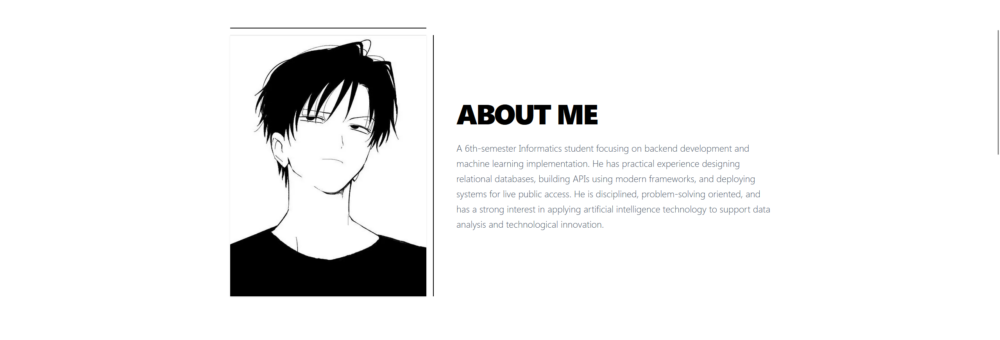

# Minimalist Noir Portfolio — Backend & AI Focused

<div align="center">
  
  <p align="center"><i>Tampilan antarmuka "Industrial Noir" pada portofolio Muhammad Gilang Ramadhan.</i></p>
</div>

A high-performance, minimalist portfolio built with **Next.js 15+** and **Tailwind CSS v4**. This project showcases a deep focus on backend architecture, featuring real-time data integration with the GitHub API and a refined "Industrial Noir" aesthetic.

## Key Technical Features

-   **Dynamic Data Fetching:** Integrated with GitHub API v3 to automatically sync pinned repositories and latest project data.
-   **Server-Side Rendering (SSR):** Optimized for SEO and performance using Next.js App Router.
-   **Advanced Animations:** Smooth-scrolling with **Lenis** and complex visual transitions using **Framer Motion**.
-   **Hybrid Architecture:** Strategic separation of Server Components (for data integrity) and Client Components (for interactive UI).
-   **Modern Styling:** Powered by Tailwind CSS v4 using a CSS-first configuration approach.

## Tech Stack

-   **Framework:** [Next.js](https://nextjs.org/) (App Router)
-   **Styling:** [Tailwind CSS v4](https://tailwindcss.com/)
-   **Animation:** [Framer Motion](https://www.framer.com/motion/) & [Lenis Scroll](https://lenis.darkroom.engineering/)
-   **Icons:** [Phosphor Icons](https://phosphoricons.com/)
-   **Backend Logic:** Node.js / Fetch API with Revalidation Logic

## Project Structure

```text
src/
├── app/            # Server components & routing
├── components/     # Reusable Client/Server UI components
├── lib/            # Backend services (GitHub API logic)
└── public/         # Static assets (Profile images, etc.)
```

## Setup & Installation
Clone the repository:
```Bash
    git clone [https://github.com/Ramadhan930/my-portfolio.git](https://github.com/Ramadhan930/my-portfolio.git)
```
Install dependencies:
```Bash
    npm install
```
Environment Variables:
Create a .env.local file in the root directory (optional for higher rate limits):
Cuplikan kode
```
    GITHUB_TOKEN=your_personal_access_token_here
```

Run development server:
```Bash
    npm run dev
```

## Security Mindset

This project follows best practices for modern web security:
```
    Zero Hardcoded Secrets: All API configurations are managed via environment variables.
    Data Caching: Strategic use of Next.js revalidation to prevent API abuse (Rate Limiting).
    Sanitized Metadata: Optimized assets for privacy and performance.
```

Built with 🖤 by Muhammad Gilang Ramadhan


---

